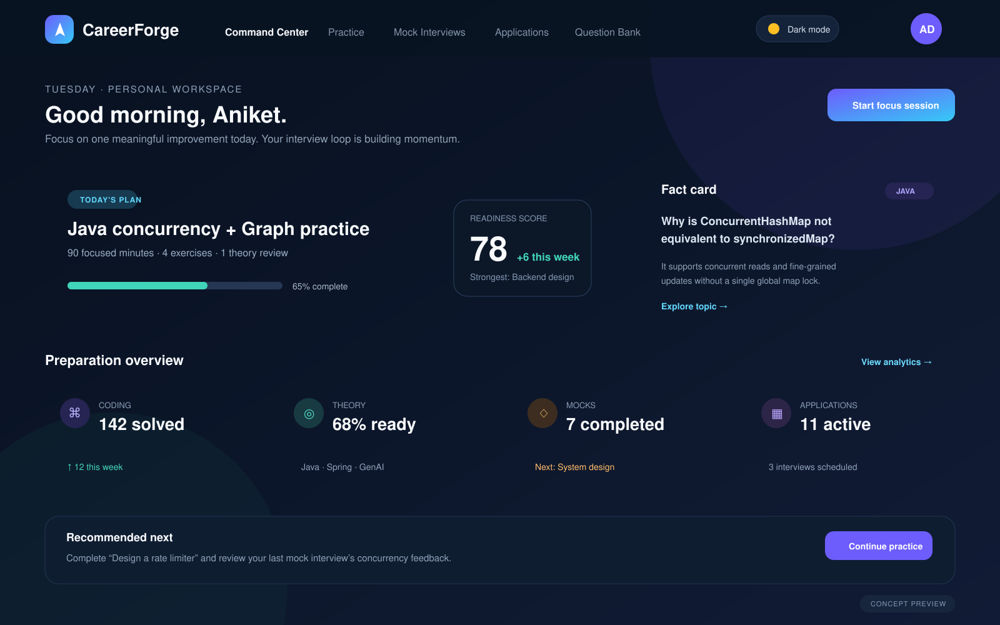
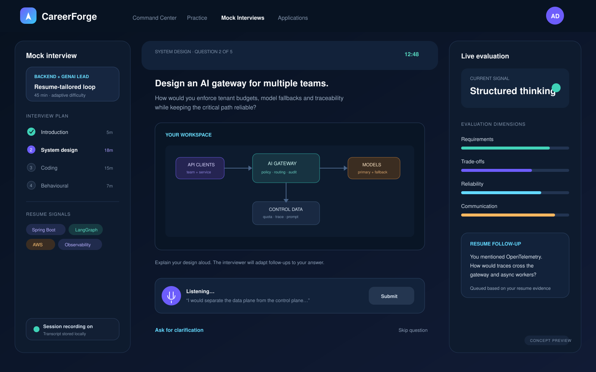
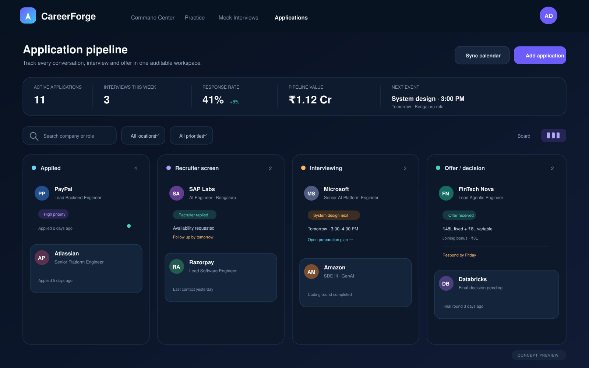
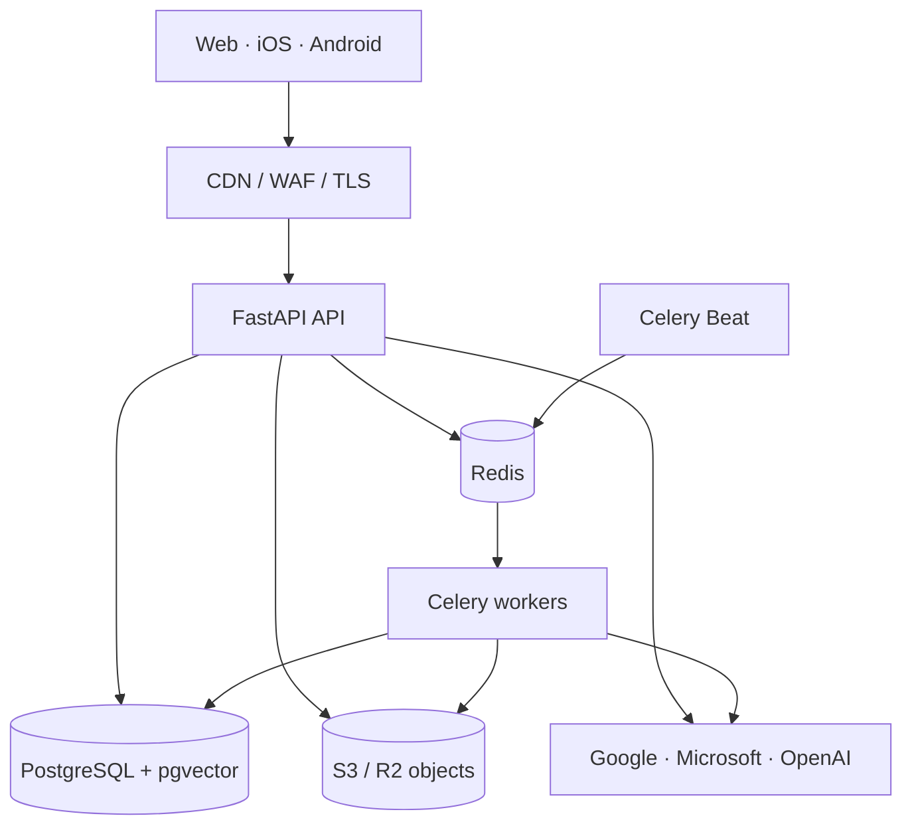
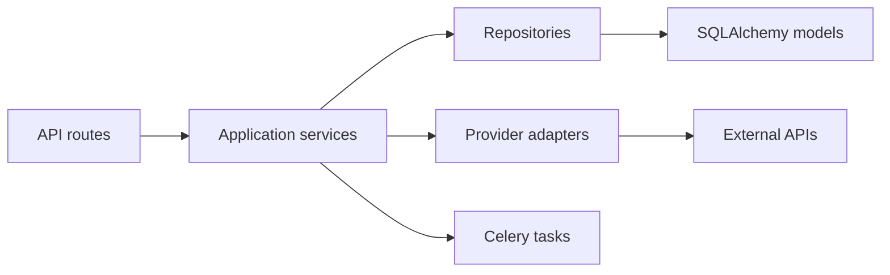
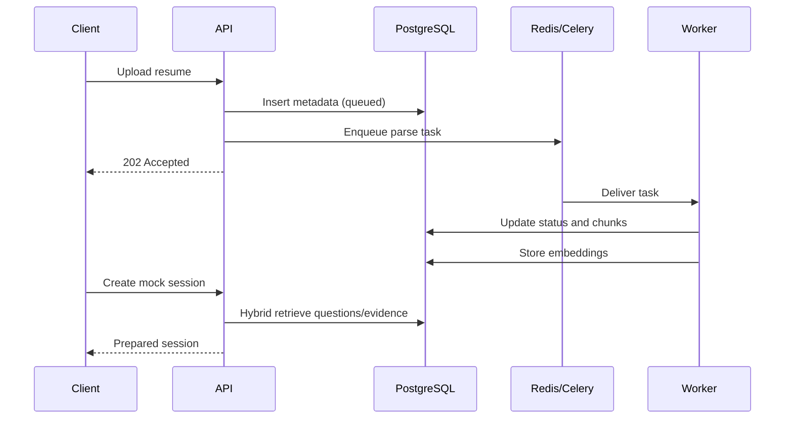
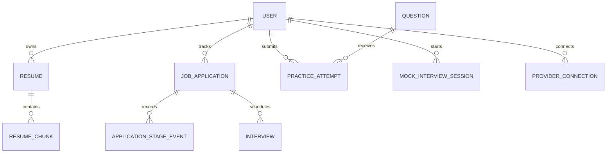

# Interview Prep Platform API

A production-oriented Python backend for a complete interview-preparation workspace: curated
DSA and theory practice, resume-aware mock interviews, SQL/NoSQL/vector-database exercises,
job-application tracking, interview notes, and Gmail/Outlook calendar synchronization.

The repository is intentionally designed as a portfolio-grade system: clear module boundaries,
secure defaults, asynchronous I/O, durable background work, vector retrieval, observable
operations, automated tests, migrations, containers, and CI.

> **Project status:** The core API, schema, workers, security primitives, local infrastructure,
> and integration seams are implemented. Provider callbacks, production resume extraction, and
> isolated code execution are explicit next-stage adapters rather than simulated features.

## Product UI concepts

The backend is designed to power **CareerForge**, an AI-assisted interview preparation and job
application workspace. The following images are frontend integration concepts, not screenshots of
an implemented frontend in this API repository. They make the intended product flows and API
consumers explicit without overstating the backend's current scope.

### Command center



### Resume-aware mock interview



### Application and offer tracker



## What is included

- JWT access and refresh authentication with Argon2id password hashing
- PostgreSQL system of record with ownership-aware indexes and immutable stage history
- `pgvector` HNSW indexes for resume evidence and semantic question retrieval
- Private S3-compatible resume storage (MinIO locally; AWS S3 or Cloudflare R2 in production)
- Redis for cache, rate-limit state, OAuth PKCE state, and Celery transport
- Celery workers plus scheduled question/fact refresh every six hours
- Resume upload pipeline with an asynchronous processing boundary
- Question bank for DSA, Java/Spring, Python/FastAPI, GenAI, SQL, NoSQL, vector databases,
  system design, and behavioural preparation
- Resume-aware mock-interview session orchestration
- Application, stage-history, compensation, interview, recruiter, and notes models
- Read-only Google and Microsoft authorization initiation with PKCE
- Structured JSON logs, request correlation, health probes, and Prometheus metrics
- Docker Compose development stack, Alembic migrations, pytest, Ruff, mypy, and GitHub Actions

## High-level design (HLD)



### Deployment units

| Unit | Responsibility | Scaling signal |
|---|---|---|
| API | Authentication, validation, orchestration, reads/writes | Request latency and concurrency |
| Worker | Parsing, embeddings, AI evaluation, provider sync | Queue age and task throughput |
| Scheduler | Enqueues global and per-connection recurring work | Singleton with leader protection |
| PostgreSQL | Source of truth, relational queries, vector search | Connections, IOPS, slow queries |
| Redis | Ephemeral state, cache, broker | Memory, ops/sec, eviction rate |
| Object store | Original resumes and future exports | Storage and request volume |

### Architectural choice

This is a **modular monolith with separate process types**. At personal and early-product scale,
it preserves transactional integrity and keeps operations understandable. Module seams allow an
integration sync service or execution sandbox to be extracted later without redesigning the API.
See [ADR 0001](docs/decisions/0001-modular-monolith.md).

## Low-level design (LLD)



Dependency direction is inward: transport and infrastructure depend on application contracts;
business workflows do not depend on FastAPI request objects. The current code stays pragmatic—
repository classes are introduced where query ownership or transaction rules benefit from them,
not as ceremonial wrappers around every SQL statement.

### Package layout

```text
src/interview_prep/
├── api/             # HTTP routes, dependency injection, versioned router
├── core/            # Settings, database lifecycle, security, logging
├── models/          # SQLAlchemy entities, enums, metadata conventions
├── repositories/    # Ownership-aware persistence operations
├── schemas/         # Versioned request/response contracts
├── services/        # Mock generation, storage and OAuth adapters
├── worker/          # Celery application and idempotent background tasks
└── main.py          # Application composition root
```

### Core request flow



### Data model



Design details:

- UUID primary keys prevent sequential-ID disclosure and simplify offline/mobile creation.
- Stage changes append to `application_stage_events`; the application retains the current stage
  for efficient board queries.
- Compound indexes support user/stage boards, upcoming actions, interview calendars, and recent
  practice activity.
- Vector HNSW indexes use cosine distance for approximate nearest-neighbour retrieval.
- `source + external_id` makes question ingestion idempotent.
- Provider credentials are separated from user/profile records and encrypted before storage.

## API surface

The interactive OpenAPI UI is available at `http://localhost:8000/docs` outside production.

| Area | Representative endpoints |
|---|---|
| Health | `GET /health/live`, `GET /health/ready`, `GET /metrics` |
| Authentication | `POST /api/v1/auth/register`, `login`, `refresh`, `GET me` |
| Content | `GET /api/v1/content/questions`, `GET fact-card` |
| Resumes | `GET/POST /api/v1/resumes` |
| Mock interviews | `POST /api/v1/mock-interviews` |
| Application tracker | `GET/POST/PATCH /api/v1/tracker/applications` |
| Interviews | `GET/POST /api/v1/tracker/interviews` |
| Connections | `POST /api/v1/integrations/{google|microsoft}/authorize` |

All user data endpoints require `Authorization: Bearer <access-token>`.

## Run locally

### Prerequisites

- Docker Engine with Compose v2
- Python 3.12 for editor tooling (optional when using containers)

### One-command stack

```bash
cp .env.example .env
# Replace SECRET_KEY and TOKEN_ENCRYPTION_KEY before starting.
docker compose up --build
```

Generate secure values:

```bash
python -c "import secrets; print(secrets.token_urlsafe(48))"
python -c "from cryptography.fernet import Fernet; print(Fernet.generate_key().decode())"
```

Then open:

- API documentation: `http://localhost:8000/docs`
- MinIO console: `http://localhost:9001`
- Liveness: `http://localhost:8000/health/live`

### Native Python workflow

```bash
python -m venv .venv
source .venv/bin/activate
python -m pip install -e '.[dev]'
alembic upgrade head
uvicorn interview_prep.main:app --reload
```

In separate terminals:

```bash
celery -A interview_prep.worker.celery_app worker --loglevel=INFO
celery -A interview_prep.worker.celery_app beat --loglevel=INFO
```

## Quality gates

```bash
make format
make lint
make test
docker build -t interview-prep-api:local .
```

CI runs static analysis, formatting verification, strict type checking, tests with coverage, and
a reproducible container build. Production deployments should additionally run integration tests
against disposable PostgreSQL, Redis, and object-storage services.

## Six-hour content refresh

Celery Beat enqueues `content.refresh_question_bank` at minute 5 every sixth UTC hour. The job
updates one global content set, avoiding per-user generation costs. The pipeline is structured for:

1. ingesting only licensed or link-based material from configured sources;
2. normalizing metadata and deduplicating by source identity;
3. generating original exercises and explanations where permitted;
4. evaluating answerability, difficulty, citation validity, and safety;
5. embedding approved content and atomically activating the new set.

The repository contains deterministic seed content so local development never requires a paid API.
The production OpenAI and source-ingestion adapters belong behind the worker boundary.

## Gmail and Outlook synchronization

The authorization endpoint uses Authorization Code + PKCE and read-only scopes. OAuth state and
the PKCE verifier live in Redis for ten minutes and are never returned to the client. The remaining
production callback adapter should:

1. atomically consume the state record;
2. exchange the code with a strict timeout;
3. encrypt the refresh token with `TOKEN_ENCRYPTION_KEY`;
4. store only provider account identity, scopes, expiry, and sync cursor;
5. use incremental calendar/mail cursors and idempotent event/message identifiers;
6. classify only interview-related messages and retain a user-visible audit trail.

Public Gmail access may require Google OAuth verification. Add explicit disconnect and data-deletion
workflows before onboarding users.

## Frontend integration

Set the website's server-side `API_BASE_URL` to this deployment and call the versioned endpoints.
Keep access tokens in secure, HTTP-only cookies through a small backend-for-frontend route when the
hosting platform supports it; mobile clients should use Keychain/Keystore-backed secure storage.

Suggested production origins:

```env
CORS_ORIGINS=["https://your-site.example","capacitor://localhost"]
```

Never place `OPENAI_API_KEY`, OAuth client secrets, the token-encryption key, or database credentials
in the React or mobile bundle.

## Production topology and scaling

For the first 100 daily users, one small API instance, one worker, managed PostgreSQL, and managed
Redis are sufficient. Scale deliberately:

1. cache shared fact/question reads and use ETags;
2. cap AI and execution credits per account;
3. autoscale workers by queue age, independently of API instances;
4. use PgBouncer or a managed pooler before increasing API concurrency;
5. inspect `pg_stat_statements` before adding indexes;
6. partition high-volume attempt/audit tables only when measurements justify it;
7. isolate untrusted code execution in a separate network-restricted service—never inside API or
   worker containers.

Recommended managed mapping: Supabase/Neon/AWS RDS for PostgreSQL, Upstash/ElastiCache for Redis,
S3/R2 for objects, and any container platform with separate API/worker process definitions.

## Security and privacy

- Argon2id hashes passwords; signed JWTs have short access-token lifetimes.
- OAuth tokens are encrypted separately from the database credentials.
- Object storage is private with server-side encryption.
- Ownership checks happen in database queries, not only at route level.
- Request IDs support investigation without logging sensitive bodies.
- Production OpenAPI pages are disabled by default.

Rate limiting, audit events, refresh-token rotation/revocation, account export/deletion, malware
scanning, provider callback completion, and a secrets manager are required before public launch.
See [SECURITY.md](SECURITY.md) for the operational baseline.

## Delivery roadmap

- **Milestone 1 — personal beta:** complete resume text extraction, embeddings, frontend API client,
  and a single-user deployment.
- **Milestone 2 — private testers:** finish OAuth callbacks, audit log, refresh-token rotation,
  notifications, integration tests, and production backups.
- **Milestone 3 — paid launch:** add subscription entitlements, usage metering, deletion/export,
  provider verification, privacy/terms, and mobile push notifications.
- **Milestone 4 — code execution:** introduce a separate ephemeral sandbox control plane with CPU,
  memory, time, network, and monthly-credit limits.

## License

MIT. Third-party question sources retain their own terms; store links and original metadata rather
than copying protected problem statements unless the applicable license permits it.
